## Дипломный проект в Yandex.Cloud - Нечаев Владимир.

---

### Задание

[Ссылка на дипломный практикум](https://github.com/netology-code/devops-diplom-yandexcloud/blob/780e41858bcff72855d9c3aa06733287b368c623/README.md)

---

### Выполнение

<details>
<summary>Создание облачной инфраструктуры</summary>

1. Создал сервисный аккаунт в Yandex.Cloud с достаточными правами.
   
   - Создаем аккаунт `yc iam service-account create --name sa-dip`
   - Назначаем права `yc resource-manager folder add-access-binding default --role admin --subject serviceAccount:===++ aje*-из предыдущей команды ++===`
   - Получаем ключ `yc iam key create --folder-name default --service-account-name sa-dip --output key.json`

2. Сделал terraform который создаст специальную сервисную учетку `tf-dip` и бакет для terraform backend в основном проекте [в отдельной папке](./prep/) и запустил его
   
`terraform apply --auto-approve`

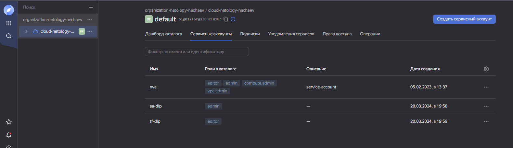

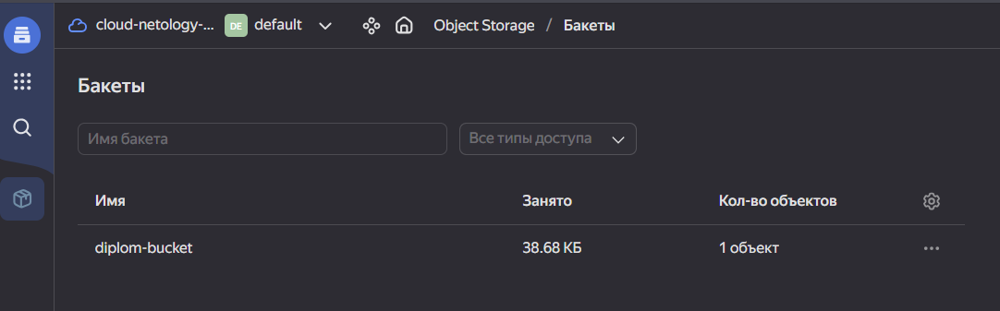

3. Сделал основновной манифест terraform с VPC и запустил его используя ключи из backend.key (из предыдущего шага) [в папке terraform](./terraform/)

`terraform init -backend-config="access_key=***" -backend-config="secret_key=***"`

`terraform apply --auto-approve`

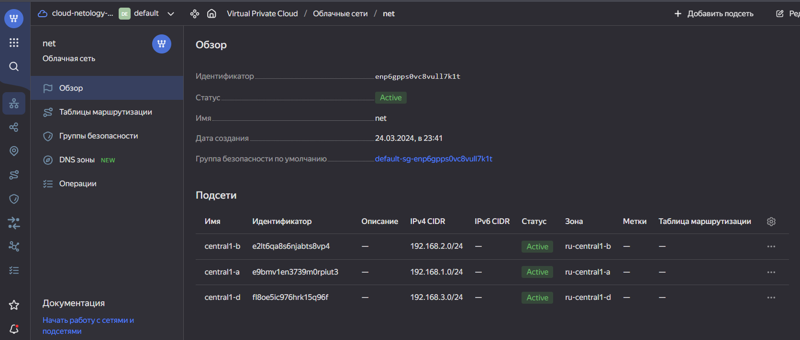

`terraform destroy` и `terraform apply` отработали корректно

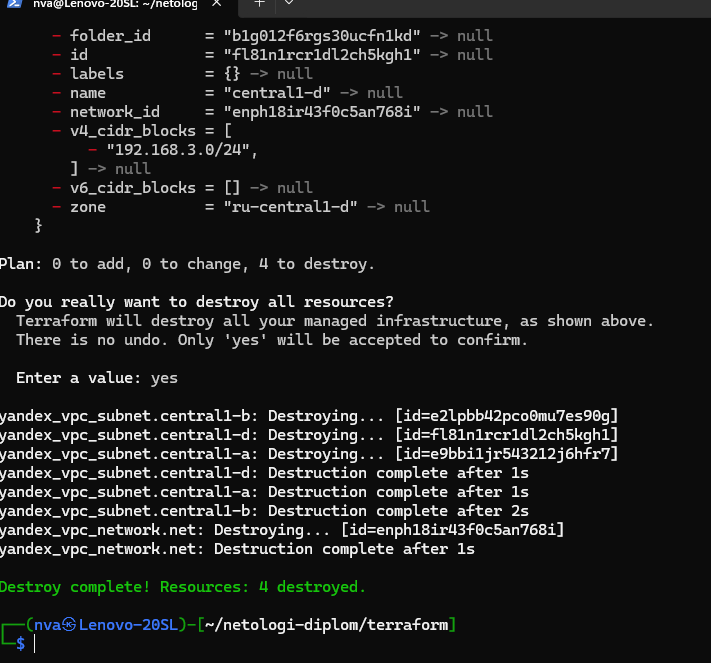

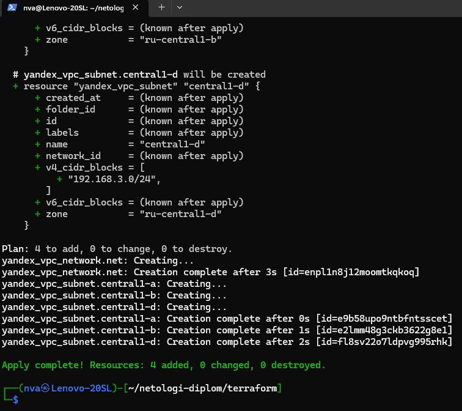

</details>

<details>
<summary>Создание Kubernetes кластера</summary>
    
1. При использовании манифестов `./terraform/vm-masters.tf`, `./terraform/vm-workers.tf` и `./terraform/ansible.tf`. будут развернуты ВМ и кластер через kubespray.

2. Установленный kubespray, переместил в `./ansible/kubespray`

```shell
wget https://github.com/kubernetes-sigs/kubespray/archive/refs/tags/v2.21.0.tar.gz
tar -xvzf v2.21.0.tar.gz
mv kubespray-2.21.0 kubespray
python3 -m pip install --upgrade pip
pip3 install -r kubespray/requirements.txt
```
3. Запустил `terraform apply --auto-approve` 

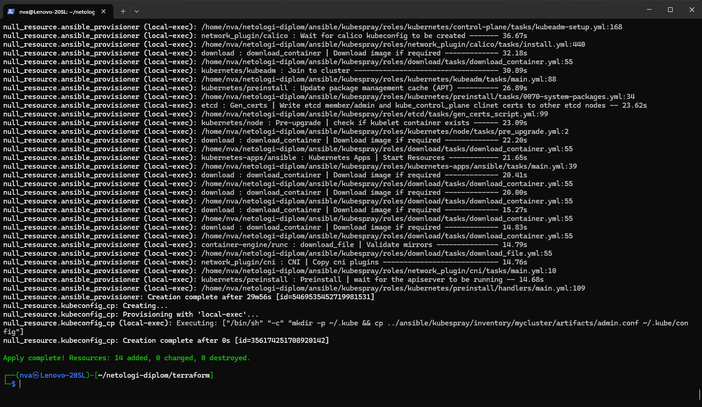

4. Проверил кластер

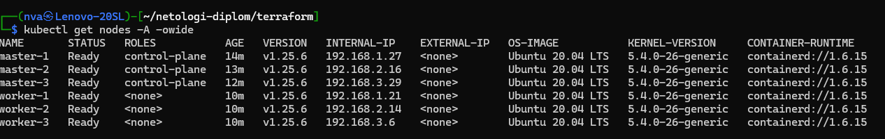 

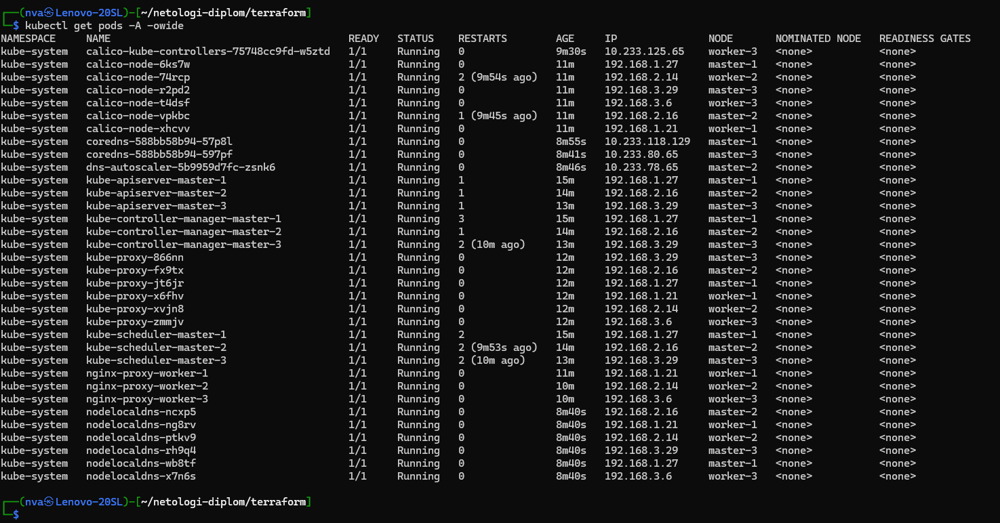

</details>

<details>
<summary>Создание Kubernetes кластера</summary>
   
1. Создал отдельны репозиторий для тестого приложения [отдельный репозиторий](https://github.com/vanechaev/testapp.git). В котором находится HTML-страница и Docker-файл создающий конетейнер с nginx.

2. Скачал, забилдил и запушил

 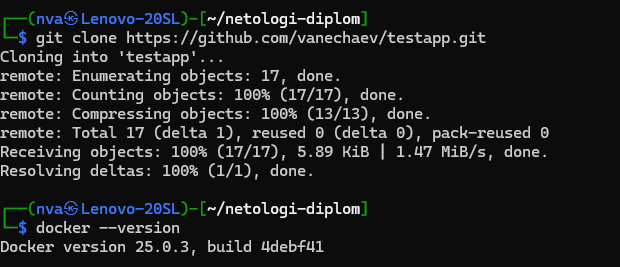 
 
 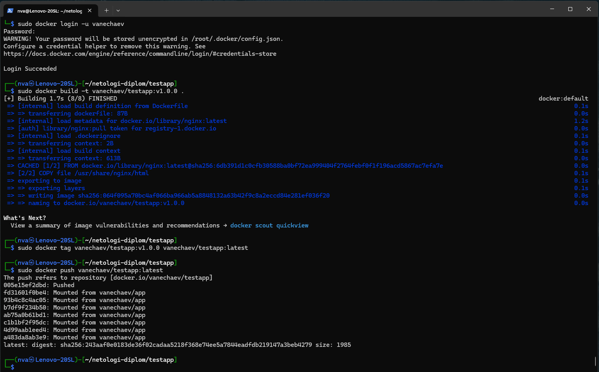

</details>

<details>
<summary>Подготовка системы мониторинга и деплой приложения</summary>

1. Используя манифест `./terraform/monitoring.tf` и helm, поднимится сервис  `./k8s/s-grafana.yaml`

2. Используя манифест `./terraform/balance.tf` будет развернут балансировщик для доступа к grafana и testapp.

3. Используя манифест `./terraform/testapp.tf` в k8s развернется тестовое приложение.

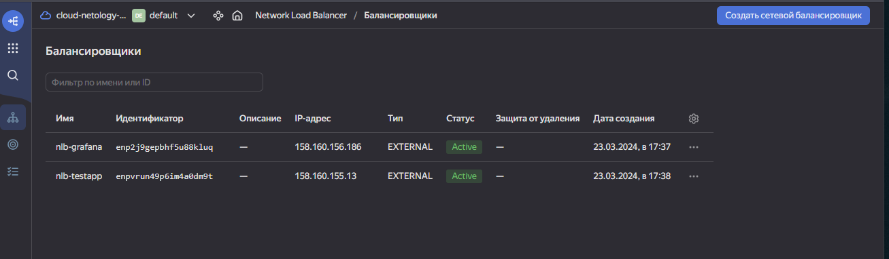  

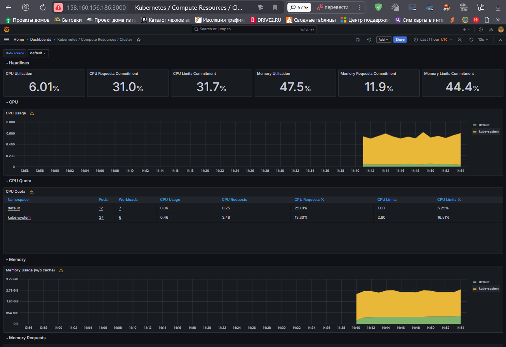  

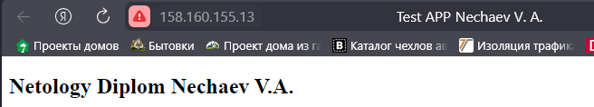

</details>

<details>
<summary>Установка и настройка CI/CD</summary>

1. Перенес на GitLab код приложения [репозиторий](https://gitlab.com/vanechaev/testapp.git)

2. Установил Агента в кластер с помощью helm используя манифест `./terraform/cicd.tf`

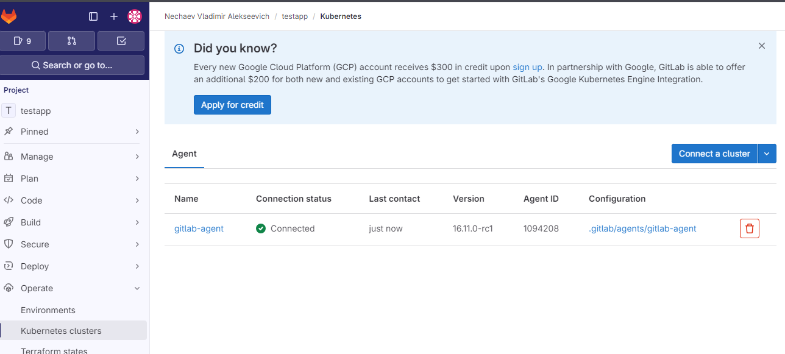

3. В файле [.gitlab-ci.yml](https://gitlab.com/vanechaev/testapp/-/blob/main/.gitlab-ci.yml?ref_type=heads) настроил пайплайн для автоматической сборки и деплоя приложения.

Пример без тега

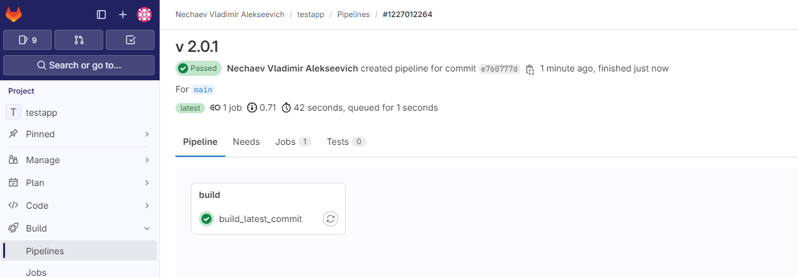

Пример с тегом

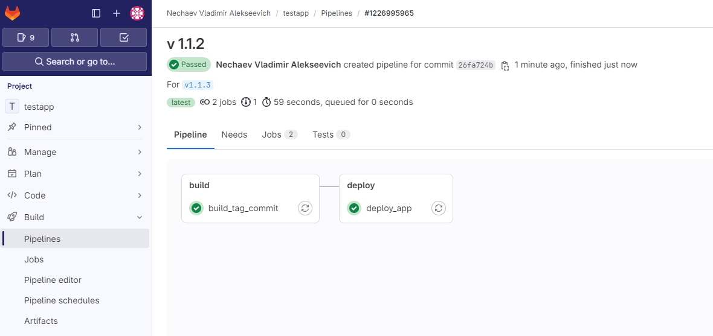

Приложение обновляется

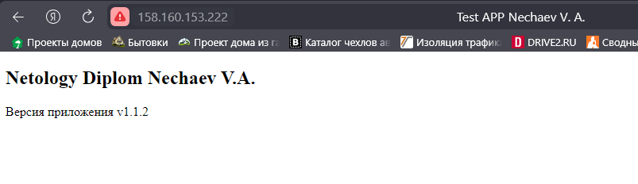

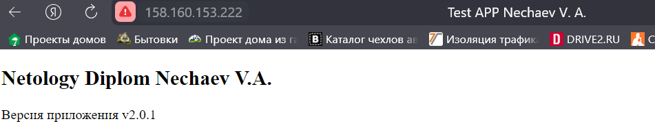

</details>

---

### Ссылки на полученные ресурсы:

#### [ссылка на веб-страницу с приложением](http://158.160.153.222/)

#### [веб-интерфейс графаны](http://158.160.154.16:3000/d/efa86fd1d0c121a26444b636a3f509a8/kubernetes-compute-resources-cluster?orgId=1&refresh=10s)
login: admin  
password: prom-operator

#### [репозиторий с приложением](https://gitlab.com/vanechaev/testapp.git)

#### [собранный docker image](https://hub.docker.com/repository/docker/vanechaev/testapp/general)

#### ссылки на выполненные джобы в gitlab

- [сборка по коммиту ](https://gitlab.com/vanechaev/testapp/-/jobs/6473591549)
- [сборка по тегу](https://gitlab.com/vanechaev/testapp/-/jobs/6484450585)
- [деплой из образа с тегом](https://gitlab.com/vanechaev/testapp/-/jobs/6484450599)
